# WordsTrainer

WordsTrainer is a vocabulary training app for language learners. It combines a .NET backend, a .NET MAUI Android client, and a small Blazor web app for password reset and administration.

The project was built as a portfolio-ready full-stack application: authentication, daily training logic, spaced review scheduling, localization, email password reset, error logging, admin diagnostics, tests, Docker deployment, and Android release packaging.

## Features

- User registration and login with JWT authentication.
- Native/target language selection and CEFR level selection.
- Daily vocabulary training with progress tracking.
- Mixed training queue: new words plus due review words.
- Spaced review scheduling based on answer quality.
- Word explanation screen with translation, level, explanation, and audio placeholder.
- Localized mobile UI based on the selected native language.
- Forgot/reset password flow through email.
- Blazor reset password website.
- Admin panel for viewing backend error logs.
- Daily Android reminder notification.
- Seed data for German vocabulary from A1 to C2.
- Automated backend tests for auth, training logic, and error logging.

## Screenshots

### Mobile App

| Welcome | Login | Registration |
|---|---|---|
| 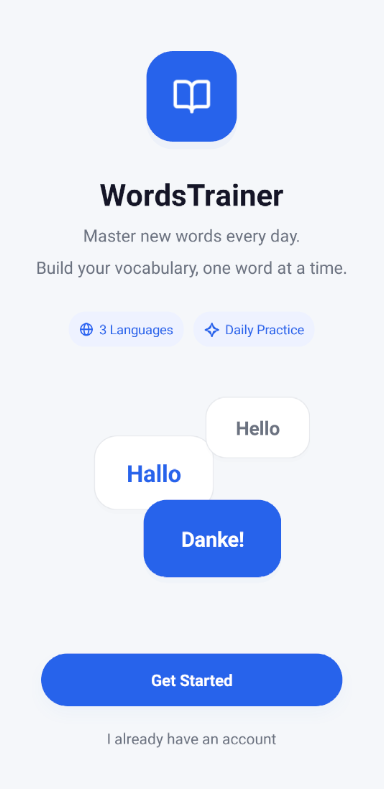 | 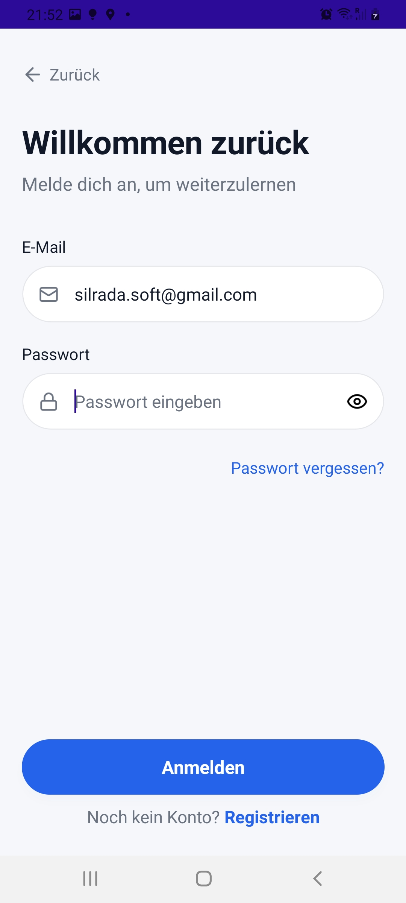 | 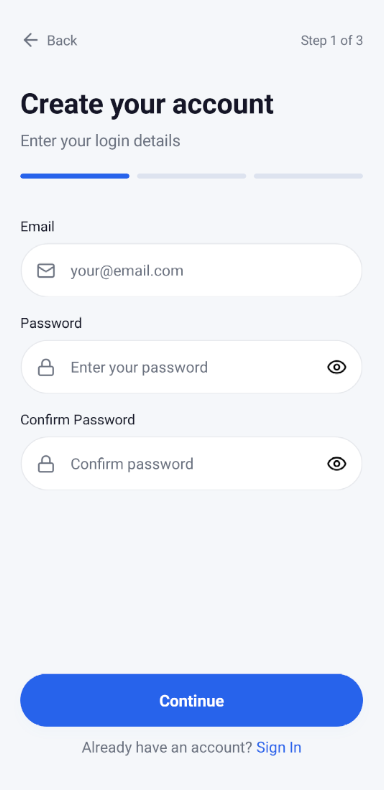 |

| Language Setup | Level Setup | Training |
|---|---|---|
| 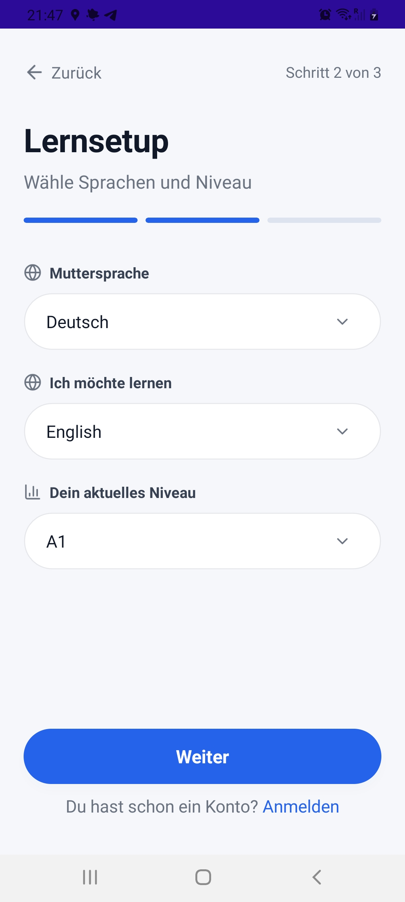 | 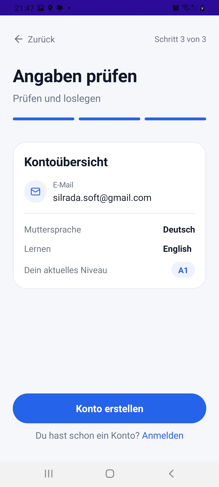 | 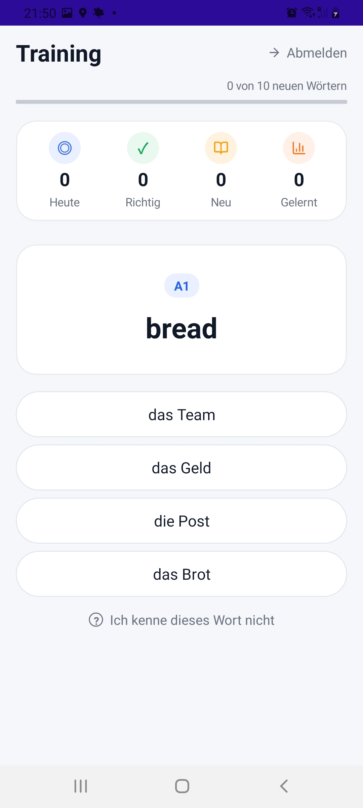 |

| Correct Answer | Wrong Answer | Explanation |
|---|---|---|
| 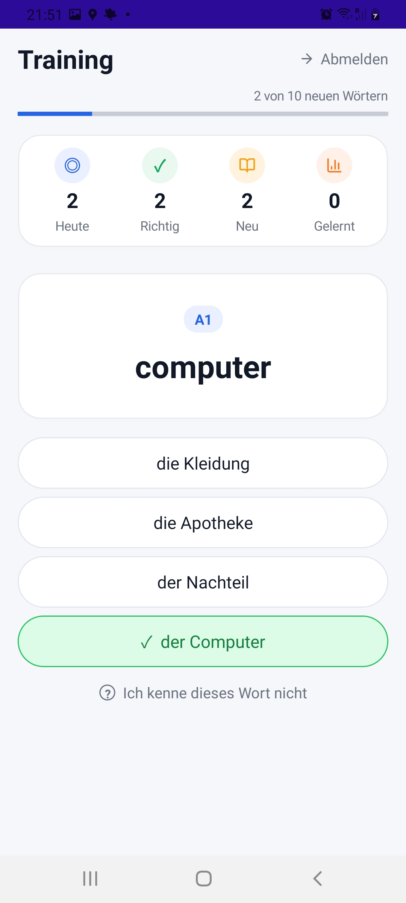 | 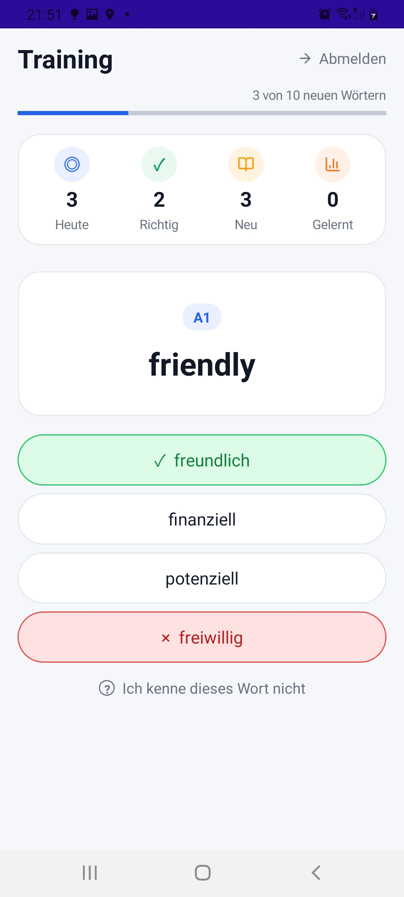 | 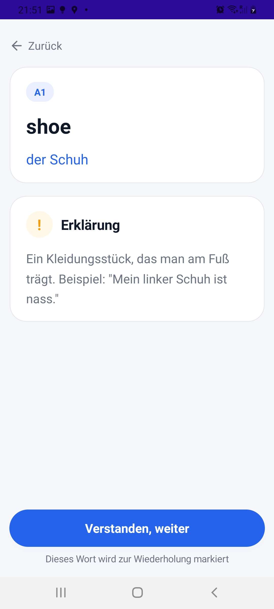 |

### Web

| Reset Password | Admin Error Logs |
|---|---|
| 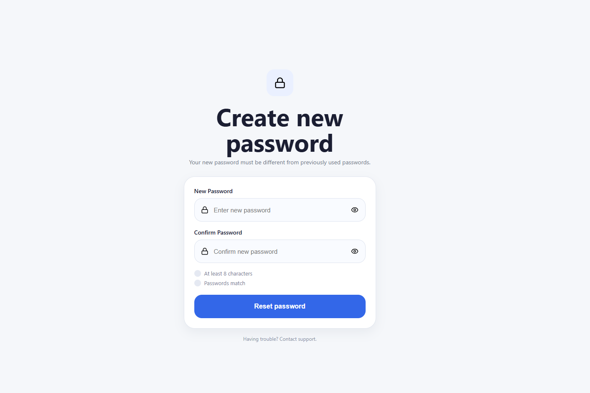 | 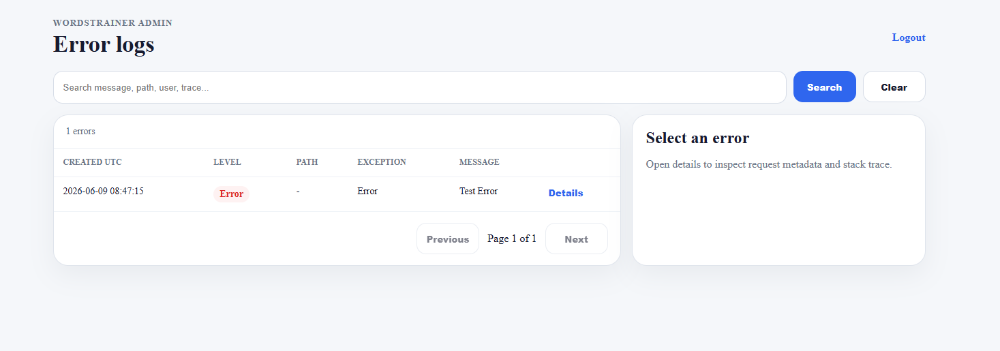 |

## Tech Stack

- Backend: ASP.NET Core Web API, Entity Framework Core
- Mobile: .NET MAUI Android
- Web: Blazor Server
- Database: PostgreSQL
- Tests: xUnit
- Deployment: Docker, Railway
- Email: Brevo SMTP

## Solution Structure

```text
WordsTrainer.Api             ASP.NET Core API
WordsTrainer.Contracts       Shared request/response DTOs
WordsTrainer.Core            Domain entities and enums
WordsTrainer.Infrastructure  EF Core DbContext, migrations, seed logic
WordsTrainer.Mobile          .NET MAUI Android app
WordsTrainer.Web             Blazor Server web app
WordsTrainer.Tests           Backend unit/integration-style tests
docs                         Release and operational notes
```

## Architecture

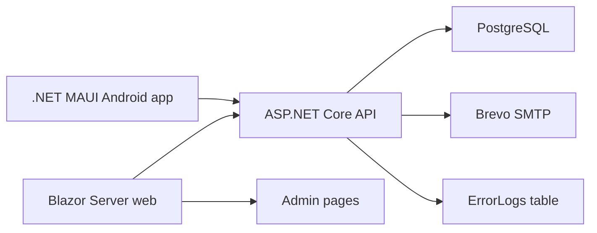

The mobile app talks only to the API. The Blazor web app is used for password reset pages and admin diagnostics. The admin web UI calls protected API endpoints using a server-side admin API key, so the key is not exposed to the browser.

## Training Logic

The training service selects words using two pools:

- Due reviews: concepts already shown to the user where `NextReviewAtUtc <= now`.
- New concepts: concepts available for the user's selected language pair and CEFR level progression.

New words are introduced from the user's selected level upward:

```text
A1 -> A2 -> B1 -> B2 -> C1 -> C2
```

If a user starts at `B1`, lower levels are skipped for new words. Review words can still appear regardless of level because they were already assigned to the user.

## Admin Panel

The admin panel is hosted by `WordsTrainer.Web`.

Routes:

```text
/admin/login
/admin/errors
```

Required Railway variables:

```text
# API service
Admin__ApiKey=<same-long-random-secret>

# Web service
Admin__ApiKey=<same-long-random-secret>
Admin__Password=<admin-login-password>
```

The API exposes admin error endpoints protected by the `X-Admin-Key` header. The web app stores the admin login session in a cookie and calls the API from the server side.

## Configuration

Use environment variables for secrets. Do not commit real values to `appsettings*.json`.

Common production variables:

```text
ConnectionStrings__DefaultConnection=
Jwt__Issuer=
Jwt__Audience=
Jwt__Key=

PasswordReset__ResetUrl=

Smtp__Host=
Smtp__Port=587
Smtp__UseSsl=true
Smtp__FromEmail=
Smtp__FromName=
Smtp__Username=
Smtp__Password=

Admin__ApiKey=
Admin__Password=
```

`Admin__Password` is needed only by `WordsTrainer.Web`.

## Local Development

Start PostgreSQL:

```powershell
docker compose -f docker-compose.postgres.yml up -d
```

Run the API:

```powershell
dotnet run --project WordsTrainer.Api/WordsTrainer.Api.csproj
```

Run the web app:

```powershell
dotnet run --project WordsTrainer.Web/WordsTrainer.Web.csproj
```

Run tests:

```powershell
dotnet test WordsTrainer.Tests/WordsTrainer.Tests.csproj
```

## Deployment

The project is deployed on Railway as separate services:

- PostgreSQL database
- `WordsTrainer.Api`
- `WordsTrainer.Web`

Docker files:

```text
Dockerfile      API service
Dockerfile.web  Blazor web service
```

EF Core migrations are applied by the API during startup.

## Android Release

Android release steps are documented in:

```text
docs/android-release.md
```

Release artifacts and signing secrets must not be committed:

```text
*.apk
*.aab
*.idsig
*.keystore
*.jks
```

## Current Status

Implemented:

- Mobile registration/login/training flow.
- Localized mobile UI.
- Training and review logic.
- Seed vocabulary from A1 to C2.
- Forgot/reset password flow.
- Blazor reset password site.
- Backend error logging.
- Admin error log viewer.
- Android release APK build and physical-device install.
- Backend tests.

Remaining before public release:

- Complete Google Play Console registration and app listing.
- Final Play Store AAB upload.
- Replace temporary admin password after any screenshots or demos.
- Add final screenshots/video demo to the portfolio page or repository.

## Portfolio Notes

This project demonstrates practical full-stack delivery:

- API design and authentication.
- EF Core data modeling and query optimization.
- PostgreSQL deployment.
- Mobile UI implementation with .NET MAUI.
- Blazor Server web tooling.
- Email integration.
- Error logging and admin diagnostics.
- Release packaging for Android.
- Automated tests around core backend behavior.
